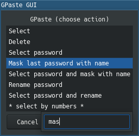
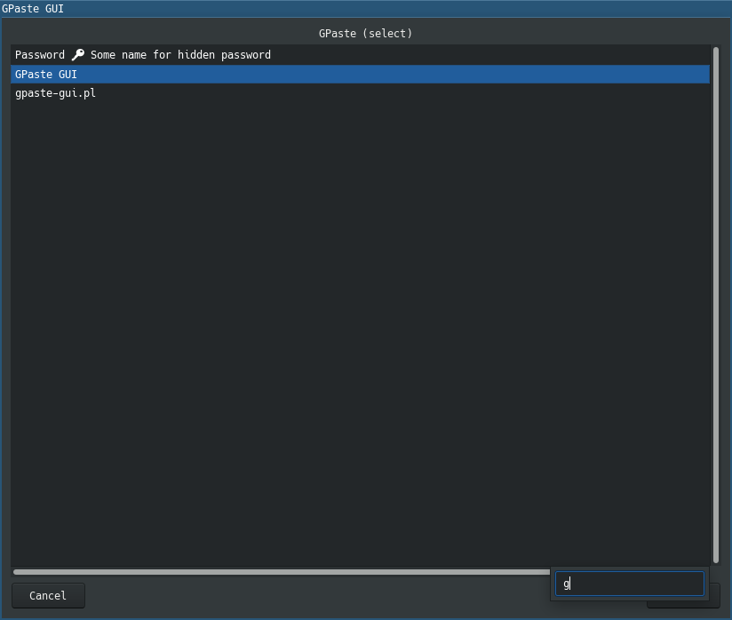

# GPaste GUI

Simple and handy GUI for managing clipboard history of GPaste daemon.





## Usage

For example just set up a hook for hot key to call `gpaste-gui.pl`
(`select` mode by default) and select chunks you need from your clipboard
history by this hot key. You also might like to set up another hook for
`gpaste-gui.pl --mode=choose` to do another actions such as masking a password
with a given name, or you even might want to call it directly by
`gpaste-gui.pl --mode=mask-last-password` (run `gpaste-gui.pl --help` for
details).

**A good hint!** In any window where you see a list of elements (such as list of
clipboard history or list of actions to do) just type few symbols that you se in
the item you want to jump at to fatsly reach it without touching the mouse. Use
arrow keys to walk between all the elements that match a search query.

Make sure you have `gpaste-gui.pl` in your `PATH` environment variable. You
could create symbolic link referencing to it in `~/.local/bin` or in
`/usr/local/bin`.

For other details run `gpaste-gui.pl -?` or look at the bottom of
[this file](gpaste-gui.pl) where that help info is described.

### Nix

You can use this piece of software with
[Nix package manager](https://nixos.org/manual/nix/stable/).
This repository provides you a configuration for it.

You can run **GPaste GUI** just like this (using `nix-shell` while your working
directory is this repository where [shell.nix](shell.nix) can be found):

``` sh
nix-shell --run gpaste-gui
```

All the required dependencies will be provided for you automatically.

### NixOS

You can add this application into your NixOS `configuration.nix` like this:

``` nix
{ pkgs, ... }:
let
  gpaste-gui-src = pkgs.fetchFromGitHub {
    owner = "unclechu";
    repo = "gpaste-gui";
    rev = "ffffffffffffffffffffffffffffffffffffffff"; # Git commit hash
    sha256 = "0000000000000000000000000000000000000000000000000000";
  };

  gpaste-gui = pkgs.callPackage gpaste-gui-src {};
in
{ environment.systemPackages = [ gpaste-gui-src ]; }
```

# Author

Viacheslav Lotsmanov

# License

[GNU/GPLv3](LICENSE)
